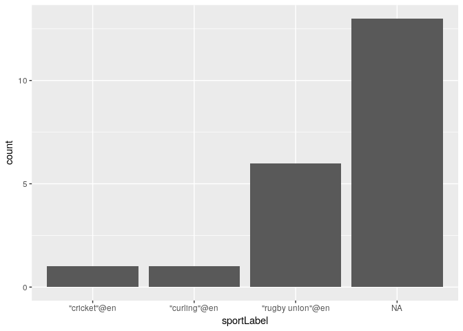

This shows some simple RStudio plotting using a Wikidata SPARQL query.

## Setup

* Install the SPARQL library

## Example

Load the libraries we'll use and configure the endpoint and query.


```r
library(SPARQL)
```

```
## Loading required package: XML
```

```
## Loading required package: RCurl
```

```
## Loading required package: bitops
```

```r
library(ggplot2)

endpoint = "https://query.wikidata.org/sparql"
```

Find the gender of people born in Otago which WikiData knows about:


```r
query <-
"SELECT DISTINCT ?item ?itemLabel ?itemDescription ?sex_or_gender ?sex_or_genderLabel WHERE {
  ?item wdt:P19 wd:Q692912.
  SERVICE wikibase:label { bd:serviceParam wikibase:language 'en'. }
  OPTIONAL { ?item wdt:P21 ?sex_or_gender. }
}"
qd <- SPARQL(endpoint, query)
df <- qd$results
ggplot(df, aes(x=sex_or_genderLabel)) + geom_bar()
```

<!-- -->

Then compare that with the preferred sports of people born in Otago which WikiData knows about.


```r
query <-
"SELECT DISTINCT ?item ?itemLabel ?itemDescription ?sex_or_gender ?sex_or_genderLabel ?sport ?sportLabel ?given_name ?given_nameLabel WHERE {
  ?item wdt:P19 wd:Q692912.
  SERVICE wikibase:label { bd:serviceParam wikibase:language 'en'. }
  OPTIONAL { ?item wdt:P21 ?sex_or_gender. }
  OPTIONAL { ?item wdt:P641 ?sport. }
  OPTIONAL { ?item wdt:P735 ?given_name. }
}"
qd2 <- SPARQL(endpoint, query)
df2 <- qd2$results
ggplot(df2, aes(x=sportLabel)) + geom_bar()
```

<!-- -->


